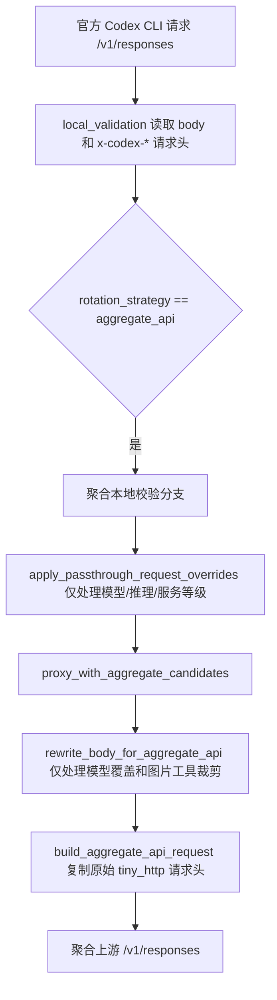

# 变更记录

## 已确认项目知识

| 范围 | 已确认事实 | 依据 |
| --- | --- | --- |
| 前端 | 前端入口使用 Vite + Vue，`@` 指向 `apps/src-vue`。 | `apps/vite.config.ts:2`、`apps/vite.config.ts:6`、`apps/vite.config.ts:9` |
| 桌面存储 | Tauri 默认将数据库文件命名为 `codexmanager.db`，并放在应用数据目录下。 | `apps/src-tauri/src/app_storage/env.rs:130`、`apps/src-tauri/src/app_storage/env.rs:135` |
| 平台密钥模式 | API Key 页面策略筛选和创建/编辑表单只保留 `account_rotation`、`aggregate_api_rotation`；行操作按钮只在账号轮转和聚合 API 轮转之间切换。 | `apps/src-vue/views/ApiKeysView.vue:88`、`apps/src-vue/views/ApiKeysView.vue:205`、`apps/src-vue/views/ApiKeysView.vue:606` |
| 严格字段过滤 | 严格请求参数白名单由 `CODEXMANAGER_STRICT_REQUEST_PARAM_ALLOWLIST` 控制。 | `crates/service/src/gateway/core/runtime_config.rs:70`、`crates/service/src/gateway/core/runtime_config.rs:496` |
| 聚合诊断日志 | `gateway-trace.log` 写入器有 24 小时保留窗口和 60 秒清理间隔。 | `crates/service/src/gateway/observability/trace_log.rs:18`、`crates/service/src/gateway/observability/trace_log.rs:19` |
| Responses 字段过滤 | `/v1/responses` 官方字段保留逻辑集中在 `retain_official_fields`。 | `crates/service/src/gateway/request/official_responses_http.rs:577` |

## 2026-06-09 删除混合轮转模式

### 需求

用户要求前后端全部删除 `hybrid_rotation` / 混合轮转（账号优先）模式，只保留聚合 API 模式和账号模式透明传递。

### 依据

- API Key 页面策略筛选、创建/编辑表单、模式标签和行切换逻辑均只保留账号轮转与聚合 API 轮转。依据：`apps/src-vue/views/ApiKeysView.vue:88`、`apps/src-vue/views/ApiKeysView.vue:205`、`apps/src-vue/views/ApiKeysView.vue:379`、`apps/src-vue/views/ApiKeysView.vue:413`、`apps/src-vue/views/ApiKeysView.vue:606`
- 账号管理页当前平台密钥模式提示和切换 payload 只在账号模式与聚合 API 模式之间处理。依据：`apps/src-vue/views/AccountsView.vue:469`、`apps/src-vue/views/AccountsView.vue:841`、`apps/src-vue/views/AccountsView.vue:863`
- 后端平台密钥策略常量和归一化逻辑只保留 `account_rotation` 与 `aggregate_api_rotation`。依据：`crates/service/src/apikey/apikey_profile.rs:4`、`crates/service/src/apikey/apikey_profile.rs:88`
- 创建和更新平台密钥时，`aggregate_api_id` 只在聚合 API 模式保存，`account_plan_filter` 只在账号模式保存。依据：`crates/service/src/apikey/apikey_create.rs:46`、`crates/service/src/apikey/apikey_create.rs:56`、`crates/service/src/apikey/apikey_update_model.rs:59`、`crates/service/src/apikey/apikey_update_model.rs:69`
- 网关执行计划只剩账号轮转和聚合 API 两类；聚合 API 模式直接走聚合候选，账号模式走账号候选。依据：`crates/service/src/gateway/upstream/executor/mod.rs:9`、`crates/service/src/gateway/upstream/executor/mod.rs:20`、`crates/service/src/gateway/upstream/proxy.rs:299`、`crates/service/src/gateway/upstream/proxy.rs:308`
- 账号透明模式只由“原生 Codex 客户端 + 账号策略”触发，聚合 API 策略不会进入账号透明模式。依据：`crates/service/src/gateway/local_validation/request.rs:961`、`crates/service/src/gateway/local_validation/request.rs:1253`、`crates/service/src/gateway/local_validation/request.rs:1341`
- Responses WebSocket 官方账号上游只支持账号模式且上游为 ChatGPT 后端；原生 Codex 旧 WebSocket 在平台密钥切到聚合 API 后会由前端代理桥接到本地 HTTP 聚合链路。依据：`crates/service/src/gateway/mod.rs:939`、`crates/service/src/http/responses_websocket.rs:659`、`crates/service/src/http/responses_websocket.rs:957`
- 账号候选预检查只保留 `Ready` 和 `Responded` 两种结果，旧混合兜底需要的空候选返回分支已移除；允许空候选仅用于原生 active turn replay 继续恢复绑定账号。依据：`crates/service/src/gateway/upstream/support/precheck.rs:4`、`crates/service/src/gateway/upstream/support/precheck.rs:93`、`crates/service/src/gateway/upstream/proxy.rs:358`
- 上游执行器不再保留单一 executor 的枚举分发，账号候选执行直接进入 Codex Responses 执行器。依据：`crates/service/src/gateway/upstream/executor/mod.rs:37`、`crates/service/src/gateway/upstream/executor/mod.rs:62`、`crates/service/src/gateway/upstream/proxy_pipeline/candidate_attempt.rs:72`
- 存量 `hybrid_rotation` 数据通过迁移改为 `account_rotation` 并清空 `aggregate_api_id`。依据：`crates/core/src/storage/mod.rs:649`、`crates/core/migrations/058_api_key_rotation_strategy_cleanup.sql:1`

### 修复

- 删除 API Key 页面和账号管理页的混合轮转入口、标签与 payload 分支。
- 删除后端 `ROTATION_HYBRID` 常量、混合策略别名归一化、网关 `HybridAccountFirst` 执行计划、账号耗尽后聚合 API 兜底分支和相关测试引用。
- 删除聚合 API 模式下 `/models` 回账号路由的兼容分支，聚合 API 模式统一进入聚合 API 候选链路。
- 删除固定返回 `openai_compat` 的旧协议解析壳和单一 executor 枚举分发。
- 将账号透明模式和 Responses WebSocket 支持收紧为账号策略专属。
- 新增 `058_api_key_rotation_strategy_cleanup` 迁移，将旧混合轮转记录切到账号轮转，避免继续出现第三种业务模式。

### 影响范围

- 平台密钥只剩两种模式：账号轮转与聚合 API 轮转。
- 账号模式保留原生 Codex 透明账号传递链路。
- 账号模式保留 Responses WebSocket 支持；聚合 API 模式不支持 WebSocket。
- 聚合 API 模式保留 HTTP 聚合 API 转发链路。
- 聚合 API 模式不再为 `/models` 请求切回账号候选。
- 账号候选为空或账号耗尽时不再转入聚合 API 兜底。

## 2026-06-09 同一对话切换账号模式与聚合 API 模式

### 需求

用户补充说明：一开始就是账号模式时走 WebSocket，一开始就是聚合 API 模式时走 HTTP POST，这两个行为符合预期；问题只发生在同一个旧 Codex 对象先以某个模式运行，中途切到另一种模式后仍沿用旧 transport。用户要求四条路线分开处理：账号模式 + WebSocket 走正常账号透明链路，聚合 API 模式 + HTTP POST 走正常聚合 API 链路，聚合 API 旧 HTTP 对象切到账号模式后继续对话，账号旧 WebSocket 对象切到聚合 API 模式后也要继续对话。

### 依据

- 用户截图 `file:///C:/Users/52417/AppData/Local/PixPin/Temp/PixPin_2026-06-09_18-36-53.png` 显示 Codex 前端出现 `Stream disconnected before completion: stream closed before response.completed`。
- 用户截图 `file:///C:/Users/52417/AppData/Local/PixPin/Temp/PixPin_2026-06-09_18-42-22.png` 显示切换前后请求日志中有账号请求 200，也有聚合 API 502。
- 用户截图 `file:///C:/Users/52417/AppData/Local/PixPin/Temp/PixPin_2026-06-09_20-16-37.png` 明确四条路线：`账号模式 + WebSocket`、`账号模式 + HTTP POST`、`聚合 API 模式 + HTTP POST`、`聚合 API 模式 + WebSocket` 必须分开处理。
- 本机数据库请求日志中，2026-06-09 18:36 到 18:39 多条账号请求上游为 `https://chatgpt.com/backend-api/codex/responses`，状态 200；对应 trace 仍记录 `request_type=http`、`route_kind=account_rotation`，说明旧对象切到账号模式后仍通过 HTTP POST 进入账号透明链路。依据：`/mnt/c/Users/52417/AppData/Roaming/com.codexmanager.desktop/codexmanager.db`、`/mnt/c/Users/52417/AppData/Roaming/com.codexmanager.desktop/gateway-trace.log`
- 前端代理此前只有 `GET /v1/responses` 且带 WebSocket upgrade 头时才进入 Responses WebSocket 处理，普通 `POST /v1/responses` 会继续转发到后端 HTTP 网关。依据：`crates/service/src/http/proxy_runtime.rs:224`
- 本地校验当前只在原生 Codex 且账号策略时进入透明账号模式；聚合 API 策略单独进入聚合 API 分支。依据：`crates/service/src/gateway/local_validation/request.rs:961`、`crates/service/src/gateway/local_validation/request.rs:1253`、`crates/service/src/gateway/local_validation/request.rs:1341`
- 本次代码将当前平台密钥模式归一为当前应走 transport：官方账号 WSS 为 `WebSocket`，聚合 API 策略为 `Http`。依据：`crates/service/src/http/responses_websocket.rs:1269`

### 修复

- 保留正常账号模式：`GET /v1/responses` WebSocket upgrade 仍进入原有 Responses WebSocket 会话，不改变账号透明 WSS 主链路。依据：`crates/service/src/http/proxy_runtime.rs:231`、`crates/service/src/http/responses_websocket.rs:209`
- 保留正常聚合 API 模式：`POST /v1/responses` 且当前平台密钥不是官方账号 WSS 时仍落回原 HTTP 代理和后端聚合 API 链路。依据：`crates/service/src/http/proxy_runtime.rs:262`
- 新增 `账号模式 + HTTP POST` 桥接：仅原生 Codex `POST /v1/responses` 且当前平台密钥支持官方账号 WSS 时进入 HTTP -> WSS 桥接；桥接会解压旧 HTTP body，补齐 `type=response.create`，连接账号上游 WSS，并把上游 WSS 文本帧编码回 Responses SSE 返回给旧 HTTP 客户端。依据：`crates/service/src/http/responses_websocket.rs:246`、`crates/service/src/http/responses_websocket.rs:263`
- 新增 `聚合 API 模式 + WebSocket` 桥接：旧 WebSocket 会话在首帧和后续文本帧发送前重新读取当前平台密钥；当前已切到聚合 API 时，关闭账号上游 WSS，改为把该 WS 帧转成 HTTP Responses body，POST 到本地后端 `/v1/responses`，再把本地 HTTP/SSE 结果转回客户端 WebSocket 文本帧。依据：`crates/service/src/http/responses_websocket.rs:659`、`crates/service/src/http/responses_websocket.rs:740`、`crates/service/src/http/responses_websocket.rs:957`、`crates/service/src/http/responses_websocket.rs:998`、`crates/service/src/http/responses_websocket.rs:1154`
- 桥接日志区分真实入口方法，HTTP->WSS 与 WS->HTTP 桥接记录为 `POST`，正常账号 WebSocket 仍记录 `GET`。依据：`crates/service/src/http/responses_websocket.rs:2920`、`crates/service/src/http/responses_websocket.rs:3031`

### 影响范围

- 只影响原生 Codex `/v1/responses` 在当前模式与客户端旧 transport 不匹配时的桥接。
- 不改变初始账号模式的客户端 WebSocket upgrade 主链路。
- 不改变初始聚合 API 模式的 HTTP POST 主链路。
- 不改变非原生 Codex 客户端的 HTTP Responses 请求。

## 2026-06-09 聚合 API 连通性测试误报失败和错误展示不完整

### 需求

用户提供截图 `file:///C:/Users/52417/AppData/Local/PixPin/Temp/PixPin_2026-06-09_18-11-52.png` 和 `file:///C:/Users/52417/AppData/Local/PixPin/Temp/PixPin_2026-06-09_18-14-56.png`，说明 `https://api.xtokenmirror.cn` 实际能通，但聚合 API 列表测试显示失败；同时顶部弹窗只显示“操作失败”，表格错误信息被省略号截断。

### 依据

- 截图显示 `https://api.xtokenmirror.cn` 行启用中，连通性列为“失败”，错误文本显示为 `provider=codex; c...`，顶部 toast 为“操作失败”。
- 本机数据库副本中该聚合 API 配置为 `protocol_mode=codex_cli`、`url=https://api.xtokenmirror.cn`、`last_test_error=provider=codex; codex probe http_status=400`。依据：`/mnt/c/Users/52417/AppData/Roaming/com.codexmanager.desktop/codexmanager.db`
- 本机请求日志中 `https://api.xtokenmirror.cn/v1/responses` 在 2026-06-09 18:17 到 18:20 多次返回 200，模型为 `gpt-5.5`。依据：`/mnt/c/Users/52417/AppData/Roaming/com.codexmanager.desktop/codexmanager.db`
- 修复前前端传输层会把 RPC 结果中的 `ok:false` 当成业务异常；聚合 API 测试结果类型本身用 `ok:false` 表示“测试完成但未连通”，本次修复后传输层只按 `error` 字段抛业务异常。依据：`apps/src-vue/api/transport.ts:131`、`crates/core/src/rpc/types.rs:467`
- 真实 Responses 请求示例包含 `instructions` 和 message-list `input`；本次修复后的 Codex CLI 探测 body 已按该形状发送。依据：`crates/service/src/aggregate_api.rs:645`、`crates/service/src/gateway/request/official_responses_http.rs:786`
- 截图可见聚合 API 列表错误行被省略号截断；本次修复后连通性列使用 `min-width`，错误文本使用 `white-space: normal` 和 `overflow-wrap: anywhere`。依据：`apps/src-vue/views/AggregateApiView.vue:91`、`apps/src-vue/views/AggregateApiView.vue:736`

### 修复

- 前端传输层只在 RPC 结果包含 `error` 字段时抛业务异常，不再把测试结果里的 `ok:false` 泛化成“操作失败”。
- 聚合 API 列表连通性错误文本允许换行，并保留完整 `title`，不再用省略号截断。
- Codex CLI 连通性探测改为发送带 `instructions` 和 message-list `input` 的 Responses 请求体，贴近真实 Codex CLI 上游请求。
- 聚合 API 探测遇到非 2xx 响应时，把上游响应摘要拼入错误信息，便于定位具体失败原因。

### 影响范围

- 影响聚合 API 页面测试按钮、测试结果 toast 和连通性错误展示。
- 影响聚合 API Codex CLI 兼容模式的连通性探测请求体；不改变真实网关转发请求。

## 2026-06-04 账号管理列表移除额度详情入口

### 需求

用户提供截图 `file:///C:/Users/52417/AppData/Local/PixPin/Temp/PixPin_2026-06-04_16-27-14.png`，要求删除红色标注部分。

### 依据

- 截图红框标注账号管理列表中额度详情区域的蓝色「详情」链接。
- 当前账号列表额度区域直接展示 5 小时和 1 周额度行，额度区域结束后进入账号状态展示，不再提供详情入口。依据：`apps/src-vue/views/AccountsView.vue:126`、`apps/src-vue/views/AccountsView.vue:149`
- 账号页状态变量列表已不再保留 `usageDialogOpen`、`selectedAccount` 这类详情弹窗状态。依据：`apps/src-vue/views/AccountsView.vue:420`

### 修复

- 移除账号管理列表额度详情区域的「详情」按钮。
- 移除该按钮容器 `.quota-actions` 样式。
- 删除该入口移除后不可达的用量详情弹窗、打开函数和仅供该弹窗使用的样式。

### 影响范围

- 影响账号管理列表中的「详情」入口展示。
- 列表中的额度百分比、重置时间、立即刷新和刷新 AT/RT 功能不变。

## 2026-06-04 仅保留 Codex/OpenAI 链路并删除 Claude/Gemini 支持

### 需求

用户提供截图 `file:///C:/Users/52417/AppData/Local/PixPin/Temp/PixPin_2026-06-04_16-29-05.png` 和 `file:///C:/Users/52417/AppData/Local/PixPin/Temp/PixPin_2026-06-04_16-29-12.png`，询问聚合 API 编辑弹窗中的供应商类型和协议模式是否存在重复。
随后用户明确说明：`Claude / Gemini 相关的代码可以删除`，并补充项目以后完全不支持 Claude Code / Gemini CLI，只保留 Codex/OpenAI。
用户进一步确认：账号模式下不固定官方上游，请求/平台密钥配置的网站是什么就读取什么。

### 依据

- 前端聚合 API 列表和编辑弹窗当前不再展示供应商类型下拉或类型列，只保留协议列和两个协议选项。依据：`apps/src-vue/views/AggregateApiView.vue:51`、`apps/src-vue/views/AggregateApiView.vue:144`
- 前端提交聚合 API 时固定写入 `providerType: "codex"`；启停操作也固定提交 Codex provider。依据：`apps/src-vue/views/AggregateApiView.vue:477`、`apps/src-vue/views/AggregateApiView.vue:624`
- 后端聚合 API 供应商常量只保留 `codex`，`normalize_provider_type` 仅接受 Codex/OpenAI 兼容别名。依据：`crates/service/src/aggregate_api.rs:15`、`crates/service/src/aggregate_api.rs:529`
- 后端协议模式仍只保留 `openai_compat` 和 `codex_cli` 两类，旧值 `responses`、`codex_responses` 会归一到 `codex_cli`。依据：`crates/service/src/aggregate_api.rs:544`
- 聚合 API 轮转候选只选择启用中的 Codex provider；指定的聚合 API ID 也必须是启用中的 Codex provider 才会参与轮转。依据：`crates/service/src/gateway/upstream/protocol/aggregate_api.rs:588`、`crates/service/src/gateway/upstream/protocol/aggregate_api.rs:849`
- 平台密钥 profile 只允许 `codex/openai_compat/authorization_bearer`，新增迁移会把存量 profile 归一到该组合，同时保留 `upstream_base_url` 和 `static_headers_json`。依据：`crates/core/migrations/057_api_key_profiles_openai_only.sql:6`、`crates/core/migrations/057_api_key_profiles_openai_only.sql:36`
- 创建和编辑平台密钥继续保存并沿用 `upstreamBaseUrl`、`staticHeadersJson`，账号模式上游解析仍优先读取平台密钥 `upstream_base_url`，否则读取运行时全局上游配置。依据：`crates/service/src/apikey/apikey_create.rs:44`、`crates/service/src/apikey/apikey_update_model.rs:101`、`crates/service/src/gateway/mod.rs:919`
- 本地校验结果携带已解析的 `upstream_base`，账号候选准备阶段沿用该值计算上游 URL 和 fallback URL，避免重新读取全局上游覆盖平台密钥自定义上游。依据：`crates/service/src/gateway/local_validation/mod.rs:19`、`crates/service/src/gateway/local_validation/request.rs:1235`、`crates/service/src/gateway/upstream/proxy.rs:560`、`crates/service/src/gateway/upstream/proxy_pipeline/request_setup.rs:30`
- 删除 Claude/Gemini 响应转换后，流式上游兼容分支仍会把 `tool_name_restore_map` 传入成功响应转换函数，因此该参数不能加未使用前缀。依据：`crates/service/src/gateway/observability/http_bridge/delivery.rs:1951`、`crates/service/src/gateway/observability/http_bridge/delivery.rs:2035`
- 删除旧 stream reader 后，`stream_readers.rs` 顶层只保留现存子模块仍通过 `super::` 使用的桥接导入。依据：`crates/service/src/gateway/observability/http_bridge/stream_readers.rs:4`

### 修复

- 移除聚合 API 前端的供应商类型筛选、类型列和表单供应商类型下拉。
- 前端创建、编辑、启停、置顶聚合 API 时固定提交 `providerType: "codex"`。
- 移除 Codex 协议模式下重复的 `Responses 官方`、`Codex Responses` 选项，只保留 `OpenAI 兼容`、`Codex CLI 兼容`。
- 将旧值 `responses`、`codex_responses` 在前端编辑回显时归一为 `Codex CLI 兼容`。
- 删除聚合 API 后端 Claude/Gemini 供应商常量、默认地址、连通性探测、模型发现和轮转分流逻辑。
- 聚合 API 网关转发不再为旧 Claude provider 设置 Anthropic Native SSE 透传协议。
- 删除 Claude/Gemini native 请求适配、SSE reader、上游 executor、本地 count tokens 兼容和 Web 入口路由。
- 平台密钥协议只保留 OpenAI/Codex 兼容；旧 native profile 值不再允许写入。
- 账号模式上游不固定官方地址，仍按平台密钥自定义上游或运行时全局上游配置解析。
- 账号模式 HTTP 候选请求不再在候选准备阶段重新解析全局上游，而是复用本地校验阶段解析出的平台密钥有效上游。
- 修复删除旧响应转换后 `respond_with_stream_upstream` 中 `tool_name_restore_map` 参数名不一致导致的编译错误。
- 清理删除旧链路后遗留的未使用导入、未使用 re-export 和无用局部变量。

### 影响范围

- 影响聚合 API 的供应商配置、连通性测试和网关轮转候选选择。
- 影响旧 Claude Code / Gemini CLI 的 native 请求入口、响应转换和本地 token 计数兼容；这些链路不再支持。
- 不影响账号池透明链路读取配置上游。

## 2026-06-04 项目协作提示词优化

### 需求

根据用户提供的项目协作规则，优化根目录 `AGENTS.md`，让规则更清晰、可执行，并统一指向 `docs/change-record.md` 作为需求、变更和项目知识记录文件。

### 依据

用户在 2026-06-04 明确提供以下要求：

| 要求 | 处理 |
| --- | --- |
| 记录写入 `docs/change-record.md` | 改为项目相对路径，避免 Windows/WSL 路径差异 |
| MD 内容不能猜测，必须有确实依据 | 增加记录依据要求和待验证处理方式 |
| 发现旧 MD 内容有问题允许修改 | 增加可修正规则 |
| 排查依靠日志和 Codex CLI 官方源码 | 增加排查依据优先级 |
| 不确认就新增日志后复现 | 增加最小诊断日志规则 |
| 尽可能删除废弃和无效兜底代码 | 增加代码清理要求和询问边界 |

### 修复

- 将原本散落的口语规则整理为 `记录要求`、`排查要求`、`代码清理要求` 三组。
- 将绝对路径改为项目相对路径 `docs/change-record.md`。
- 明确 `docs/change-record.md` 只能记录有依据的结论，不能记录猜测。
- 明确不确定时优先补最小诊断日志，等待用户重新发版复现。
- 明确可删除已确认无效的废弃兼容和兜底逻辑，不确定时先询问用户。

### 影响范围

- 根目录 `AGENTS.md`。
- 本变更记录文件。

## 2026-06-04 聚合 API 连续对话缓存偶发失效

### 需求

排查聚合 API 中同一个官方 Codex CLI 连续对话为什么会偶发缓存命中极低，并修复同一对话不应反复丢失缓存锚点的问题。

### 现象

用户提供的同一对话请求日志中，`/v1/responses` 连续请求均走同一个聚合 API 密钥 `gk_5fe2d...`、同一模型 `gpt-5.5/xhigh`，但缓存输入在相邻请求间大幅波动。

| 时间 | 总输入 | 非缓存输入 | 缓存输入 | 费用 |
| --- | ---: | ---: | ---: | ---: |
| 2026/6/4 13:58:01 | 122,149 | 2,981 | 119,168 | $0.077909 |
| 2026/6/4 13:58:25 | 123,108 | 121,188 | 1,920 | $0.620220 |
| 2026/6/4 13:58:37 | 123,954 | 121,522 | 2,432 | $0.614346 |
| 2026/6/4 13:58:49 | 124,243 | 119,763 | 4,480 | $0.604505 |
| 2026/6/4 13:59:04 | 124,409 | 12,409 | 112,000 | $0.126775 |

### 链路



### 原因

官方 Responses API 支持请求体字段 `prompt_cache_key`。官方 Codex CLI 的 Responses 请求会使用稳定线程 id 作为 `prompt_cache_key`，同时也会在请求头中带 `thread-id`、`session-id`、`x-codex-turn-metadata` 等线程信息。

### 依据

| 依据 | 已确认内容 |
| --- | --- |
| OpenAI Responses API Reference | `/v1/responses` 请求体包含 `prompt_cache_key`、`prompt_cache_retention`、`background`、`conversation`、`max_tool_calls`、`prompt`、`safety_identifier`、`stream_options`、`top_logprobs` 等字段。来源：`https://platform.openai.com/docs/api-reference/responses/object?lang=node.js` |
| OpenAI Prompt Caching Guide | 缓存依赖相同 prompt 前缀，`prompt_cache_key` 会参与缓存路由，响应 usage 中通过 `cached_tokens` 体现命中情况。来源：`https://developers.openai.com/api/docs/guides/prompt-caching` |
| OpenAI Codex 官方源码 | Codex CLI 构造 `ResponsesApiRequest` 时会设置 `prompt_cache_key`，并携带 `client_metadata`。来源：`https://github.com/openai/codex/blob/main/codex-rs/core/src/client.rs` |
| 本机 gateway trace | 聚合请求 payload 中实际出现过 `client_metadata`、`prompt_cache_key`、`text`、`include`、`store`、`stream` 等 Codex CLI body 字段。来源：`/mnt/c/Users/52417/AppData/Roaming/com.codexmanager.desktop/gateway-trace.log` |

聚合 API 链路此前存在两个问题：

| 环节 | 旧行为 | 影响 |
| --- | --- | --- |
| 官方字段过滤 | `/v1/responses` 官方字段白名单不完整，至少漏掉 `prompt_cache_key` 等字段 | 严格参数过滤开启后，官方 Codex CLI body 中的缓存锚点或已确认 body 字段会被删除 |
| 聚合诊断 | 旧日志只记录完整 payload，缺少结构化缓存锚点状态 | 排查时需要人工扫大 JSON 才能判断字段是否存在 |

因此，同一个官方 Codex CLI 对话在聚合 API 下可能把官方 body 自带的 `prompt_cache_key` 过滤掉，导致第三方 Responses 上游看不到稳定缓存锚点，只命中很短的固定前缀缓存，表现为缓存输入反复跌到 1,920、2,432、4,480 一类低值。

### 修复

- 将当前官方 `/v1/responses` 请求体字段补齐到官方字段白名单，包括 `background`、`conversation`、`max_tool_calls`、`prompt`、`prompt_cache_key`、`prompt_cache_retention`、`safety_identifier`、`stream_options`、`top_logprobs`。
- 将 Codex CLI 实际携带且源码可确认的 `client_metadata` 加入 `/v1/responses` 严格保留列表。
- 聚合 API 不再根据 header 猜测并注入新的 `prompt_cache_key`。
- 增加 `AGGREGATE_PROMPT_CACHE_KEY` 诊断日志，只记录字段来源状态和指纹。
- 增加覆盖用例，验证严格字段过滤开启时仍保留官方 body 字段，同时继续删除非官方字段。

### 影响范围

- 仅影响聚合 API 下的 OpenAI Responses 请求。
- 后续 2026-06-04 变更已移除 Claude/Gemini native 兼容链路。
- 不改变账号池透明链路读取配置上游。
- 不改变前端日志展示。

## 2026-06-04 请求日志输出内容重复

### 需求

排查请求日志详情弹窗中的输出内容为什么会偶发重复 3 次，并修复日志采集重复拼接问题。

### 现象

- 页面：请求日志详情弹窗「输出内容」。
- 路径：`/v1/responses`。
- 表现：部分请求的同一段输出内容连续出现多次，部分请求正常。

### 原因

OpenAI Responses SSE 流在不同请求中返回的事件组合不完全一致。异常请求会同时出现增量文本和最终全文快照，例如：

```text
response.output_text.delta
response.output_text.done
response.completed
```

原逻辑把这些事件中的文本都当成新增输出追加到 `compact_output_text`，因此当 `done` 或 `completed` 携带全文时，会和前面已收集的 delta 文本重复。

### 修复

- 为 OpenAI Responses SSE 事件保留事件类型语义。
- passthrough 采集器记录是否已经收集过输出增量。
- 合并输出时区分增量和全文快照：
  - delta 继续按顺序追加。
  - done/completed 作为快照补全或替换已有前缀。
  - 已经收集到增量时，不再把同一份全文快照追加成新文本。
- 增加回归用例覆盖 `delta + done + completed` 同时出现时只记录一份输出内容。

### 影响范围

- 服务端请求日志输出内容采集。
- `/v1/responses` passthrough SSE 流。
- 前端详情弹窗仅显示后端字段，本次未修改前端展示逻辑。

## 2026-06-04 切换聚合 API 后旧 WebSocket 仍走账号模式

### 需求

排查对话进行到一半时，将平台密钥从账号模式切换为聚合 API 模式后继续请求，请求日志仍显示账号模式的问题，并确认是日志错误还是实际仍在走账号模式。

### 结论

| 链路 | 已确认行为 | 依据 |
| --- | --- | --- |
| 普通 HTTP 请求 | 每次请求都会重新读取平台密钥配置；切到 `aggregate_api_rotation` 后会进入聚合 API 分支，不会因为旧会话绑定继续强制走账号池。 | `crates/service/src/gateway/local_validation/mod.rs:118`、`crates/service/src/gateway/local_validation/request.rs:1342` |
| 本机 HTTP 近期日志 | 本机 `gateway-trace.log` 中已出现 `/v1/responses` 的 `route_kind=aggregate_api` 和 `AGGREGATE_ATTEMPT`，说明普通 HTTP 链路已实际走聚合 API。 | `/mnt/c/Users/52417/AppData/Roaming/com.codexmanager.desktop/gateway-trace.log` |
| Responses WebSocket | 握手阶段会把当时的平台密钥配置保存进 `WsRequestContext`；本次修复前，同一条连接里的帧继续使用握手时的账号上游。 | `crates/service/src/http/responses_websocket.rs:63`、`crates/service/src/http/responses_websocket.rs:675` |

因此，如果请求是普通 HTTP，请求日志仍显示账号模式通常要继续看日志字段或具体记录；但如果请求来自切换前已经建立的 Responses WebSocket 长连接，则不是单纯日志错误，实际请求也仍在走握手时的账号模式。

### 修复

- 在 Responses WebSocket 首帧发往上游前，重新读取当前平台密钥配置并判断当前应走 WebSocket 还是 HTTP。
- 在 Responses WebSocket 后续文本帧发往上游前，继续执行同样判断。
- 如果平台密钥已经切换到聚合 API 模式，旧 WebSocket 文本帧进入 WS -> HTTP 桥接，避免继续把新请求发到旧账号上游。
- 如果平台密钥切到其他不支持 WebSocket 且不是聚合 API 的模式，仍返回 `responses_websocket_route_changed` 错误并关闭旧连接。
- 新增 `responses_ws_route_changed` 诊断日志，记录初始模式、当前模式、当前协议和当前有效上游。

### 影响范围

- 影响 Responses WebSocket 长连接切到聚合 API 模式后的文本帧。
- 不改变普通 HTTP 聚合 API 主路由。
- 不新增前端展示逻辑。
