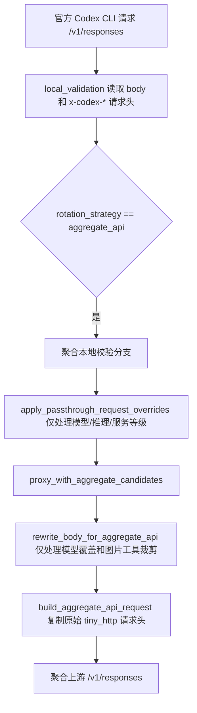

# 变更记录

## 2026-06-04 聚合 API 连续对话缓存偶发失效

### 需求

排查聚合 API 中同一个官方 Codex CLI 连续对话为什么会偶发缓存命中极低，并修复同一对话不应反复丢失缓存锚点的问题。

### 现象

用户提供的同一对话请求日志中，`/v1/responses` 连续请求均走同一个聚合 API 密钥 `gk_5fe2d...`、同一模型 `gpt-5.5/xhigh`，但缓存输入在相邻请求间大幅波动。

| 时间 | 总输入 | 非缓存输入 | 缓存输入 | 费用 |
| --- | ---: | ---: | ---: | ---: |
| 2026/6/4 13:58:01 | 122,149 | 2,981 | 119,168 | $0.077909 |
| 2026/6/4 13:58:25 | 123,108 | 121,188 | 1,920 | $0.620220 |
| 2026/6/4 13:58:37 | 123,954 | 121,522 | 2,432 | $0.614346 |
| 2026/6/4 13:58:49 | 124,243 | 119,763 | 4,480 | $0.604505 |
| 2026/6/4 13:59:04 | 124,409 | 12,409 | 112,000 | $0.126775 |

### 链路



### 原因

官方 Responses API 支持请求体字段 `prompt_cache_key`。官方 Codex CLI 的 Responses 请求会使用稳定线程 id 作为 `prompt_cache_key`，同时也会在请求头中带 `thread-id`、`session-id`、`x-codex-turn-metadata` 等线程信息。

聚合 API 链路此前存在两个问题：

| 环节 | 旧行为 | 影响 |
| --- | --- | --- |
| 官方字段过滤 | `/v1/responses` 官方字段白名单漏掉 `prompt_cache_key` | 严格参数过滤开启后，官方 Codex CLI body 中的缓存锚点会被删除 |
| 聚合诊断 | 旧日志只记录完整 payload，缺少结构化缓存锚点状态 | 排查时需要人工扫大 JSON 才能判断字段是否存在 |

因此，同一个官方 Codex CLI 对话在聚合 API 下可能把官方 body 自带的 `prompt_cache_key` 过滤掉，导致第三方 Responses 上游看不到稳定缓存锚点，只命中很短的固定前缀缓存，表现为缓存输入反复跌到 1,920、2,432、4,480 一类低值。

### 修复

- 将 `prompt_cache_key` 加入 `/v1/responses` 官方字段白名单。
- 聚合 API 不再根据 header 猜测并注入新的 `prompt_cache_key`。
- 增加 `AGGREGATE_PROMPT_CACHE_KEY` 诊断日志，只记录字段来源状态和指纹。
- 增加覆盖用例，验证严格字段过滤开启时仍保留官方 body 中的 `prompt_cache_key`。

### 影响范围

- 仅影响聚合 API 下的 OpenAI Responses 请求。
- 不改变 Claude/Gemini 聚合链路。
- 不改变账号池透明链路。
- 不改变前端日志展示。

## 2026-06-04 请求日志输出内容重复

### 需求

排查请求日志详情弹窗中的输出内容为什么会偶发重复 3 次，并修复日志采集重复拼接问题。

### 现象

- 页面：请求日志详情弹窗「输出内容」。
- 路径：`/v1/responses`。
- 表现：部分请求的同一段输出内容连续出现多次，部分请求正常。

### 原因

OpenAI Responses SSE 流在不同请求中返回的事件组合不完全一致。异常请求会同时出现增量文本和最终全文快照，例如：

```text
response.output_text.delta
response.output_text.done
response.completed
```

原逻辑把这些事件中的文本都当成新增输出追加到 `compact_output_text`，因此当 `done` 或 `completed` 携带全文时，会和前面已收集的 delta 文本重复。

### 修复

- 为 OpenAI Responses SSE 事件保留事件类型语义。
- passthrough 采集器记录是否已经收集过输出增量。
- 合并输出时区分增量和全文快照：
  - delta 继续按顺序追加。
  - done/completed 作为快照补全或替换已有前缀。
  - 已经收集到增量时，不再把同一份全文快照追加成新文本。
- 增加回归用例覆盖 `delta + done + completed` 同时出现时只记录一份输出内容。

### 影响范围

- 服务端请求日志输出内容采集。
- `/v1/responses` passthrough SSE 流。
- 前端详情弹窗仅显示后端字段，本次未修改前端展示逻辑。
