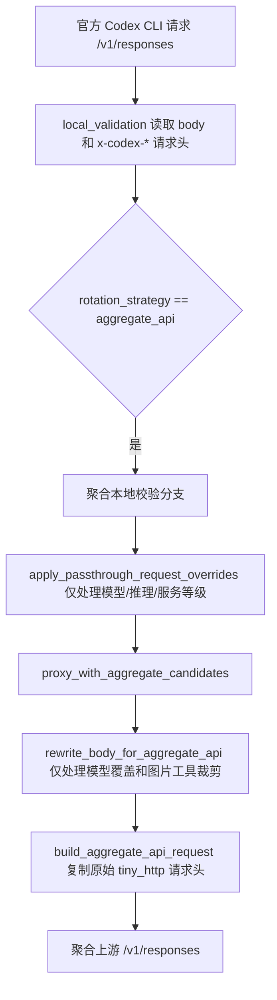

# 变更记录

## 已确认项目知识

| 范围 | 已确认事实 | 依据 |
| --- | --- | --- |
| 前端 | 前端入口使用 Vite + Vue，`@` 指向 `apps/src-vue`。 | `apps/vite.config.ts:2`、`apps/vite.config.ts:6`、`apps/vite.config.ts:9` |
| 桌面存储 | Tauri 默认将数据库文件命名为 `codexmanager.db`，并放在应用数据目录下。 | `apps/src-tauri/src/app_storage/env.rs:130`、`apps/src-tauri/src/app_storage/env.rs:135` |
| 平台密钥模式 | API Key 页面存在 `account_rotation`、`aggregate_api_rotation`、`hybrid_rotation` 三个筛选值，行操作按钮只在账号轮转和聚合 API 轮转之间切换。 | `apps/src-vue/views/ApiKeysView.vue:101`、`apps/src-vue/views/ApiKeysView.vue:104`、`apps/src-vue/views/ApiKeysView.vue:191` |
| 严格字段过滤 | 严格请求参数白名单由 `CODEXMANAGER_STRICT_REQUEST_PARAM_ALLOWLIST` 控制。 | `crates/service/src/gateway/core/runtime_config.rs:70`、`crates/service/src/gateway/core/runtime_config.rs:496` |
| 聚合诊断日志 | `gateway-trace.log` 写入器有 24 小时保留窗口和 60 秒清理间隔。 | `crates/service/src/gateway/observability/trace_log.rs:18`、`crates/service/src/gateway/observability/trace_log.rs:19` |
| Responses 字段过滤 | `/v1/responses` 官方字段保留逻辑集中在 `retain_official_fields`。 | `crates/service/src/gateway/request/official_responses_http.rs:577` |

## 2026-06-04 账号管理列表移除额度详情入口

### 需求

用户提供截图 `file:///C:/Users/52417/AppData/Local/PixPin/Temp/PixPin_2026-06-04_16-27-14.png`，要求删除红色标注部分。

### 依据

- 截图红框标注账号管理列表中额度详情区域的蓝色「详情」链接。
- 当前账号列表额度区域直接展示 5 小时和 1 周额度行，额度区域结束后进入账号状态展示，不再提供详情入口。依据：`apps/src-vue/views/AccountsView.vue:126`、`apps/src-vue/views/AccountsView.vue:149`
- 账号页状态变量列表已不再保留 `usageDialogOpen`、`selectedAccount` 这类详情弹窗状态。依据：`apps/src-vue/views/AccountsView.vue:420`

### 修复

- 移除账号管理列表额度详情区域的「详情」按钮。
- 移除该按钮容器 `.quota-actions` 样式。
- 删除该入口移除后不可达的用量详情弹窗、打开函数和仅供该弹窗使用的样式。

### 影响范围

- 影响账号管理列表中的「详情」入口展示。
- 列表中的额度百分比、重置时间、立即刷新和刷新 AT/RT 功能不变。

## 2026-06-04 聚合 API 移除 Claude/Gemini 供应商并去重协议模式

### 需求

用户提供截图 `file:///C:/Users/52417/AppData/Local/PixPin/Temp/PixPin_2026-06-04_16-29-05.png` 和 `file:///C:/Users/52417/AppData/Local/PixPin/Temp/PixPin_2026-06-04_16-29-12.png`，询问聚合 API 编辑弹窗中的供应商类型和协议模式是否存在重复。
随后用户明确说明：`Claude / Gemini 相关的代码可以删除`。

### 依据

- 前端聚合 API 列表和编辑弹窗当前不再展示供应商类型下拉或类型列，只保留协议列和两个协议选项。依据：`apps/src-vue/views/AggregateApiView.vue:51`、`apps/src-vue/views/AggregateApiView.vue:144`
- 前端提交聚合 API 时固定写入 `providerType: "codex"`；启停操作也固定提交 Codex provider。依据：`apps/src-vue/views/AggregateApiView.vue:477`、`apps/src-vue/views/AggregateApiView.vue:624`
- 后端聚合 API 供应商常量只保留 `codex`，`normalize_provider_type` 仅接受 Codex/OpenAI 兼容别名。依据：`crates/service/src/aggregate_api.rs:15`、`crates/service/src/aggregate_api.rs:529`
- 后端协议模式仍只保留 `openai_compat` 和 `codex_cli` 两类，旧值 `responses`、`codex_responses` 会归一到 `codex_cli`。依据：`crates/service/src/aggregate_api.rs:544`
- 聚合 API 轮转候选只选择启用中的 Codex provider；指定的聚合 API ID 也必须是启用中的 Codex provider 才会参与轮转。依据：`crates/service/src/gateway/upstream/protocol/aggregate_api.rs:588`、`crates/service/src/gateway/upstream/protocol/aggregate_api.rs:849`

### 修复

- 移除聚合 API 前端的供应商类型筛选、类型列和表单供应商类型下拉。
- 前端创建、编辑、启停、置顶聚合 API 时固定提交 `providerType: "codex"`。
- 移除 Codex 协议模式下重复的 `Responses 官方`、`Codex Responses` 选项，只保留 `OpenAI 兼容`、`Codex CLI 兼容`。
- 将旧值 `responses`、`codex_responses` 在前端编辑回显时归一为 `Codex CLI 兼容`。
- 删除聚合 API 后端 Claude/Gemini 供应商常量、默认地址、连通性探测、模型发现和轮转分流逻辑。
- 聚合 API 网关转发不再为旧 Claude provider 设置 Anthropic Native SSE 透传协议。

### 影响范围

- 影响聚合 API 的供应商配置、连通性测试和网关轮转候选选择。
- 不删除全局 Claude/Gemini 请求协议适配模块；本次只清理聚合 API 供应商配置和轮转分支。

## 2026-06-04 项目协作提示词优化

### 需求

根据用户提供的项目协作规则，优化根目录 `AGENTS.md`，让规则更清晰、可执行，并统一指向 `docs/change-record.md` 作为需求、变更和项目知识记录文件。

### 依据

用户在 2026-06-04 明确提供以下要求：

| 要求 | 处理 |
| --- | --- |
| 记录写入 `docs/change-record.md` | 改为项目相对路径，避免 Windows/WSL 路径差异 |
| MD 内容不能猜测，必须有确实依据 | 增加记录依据要求和待验证处理方式 |
| 发现旧 MD 内容有问题允许修改 | 增加可修正规则 |
| 排查依靠日志和 Codex CLI 官方源码 | 增加排查依据优先级 |
| 不确认就新增日志后复现 | 增加最小诊断日志规则 |
| 尽可能删除废弃和无效兜底代码 | 增加代码清理要求和询问边界 |

### 修复

- 将原本散落的口语规则整理为 `记录要求`、`排查要求`、`代码清理要求` 三组。
- 将绝对路径改为项目相对路径 `docs/change-record.md`。
- 明确 `docs/change-record.md` 只能记录有依据的结论，不能记录猜测。
- 明确不确定时优先补最小诊断日志，等待用户重新发版复现。
- 明确可删除已确认无效的废弃兼容和兜底逻辑，不确定时先询问用户。

### 影响范围

- 根目录 `AGENTS.md`。
- 本变更记录文件。

## 2026-06-04 聚合 API 连续对话缓存偶发失效

### 需求

排查聚合 API 中同一个官方 Codex CLI 连续对话为什么会偶发缓存命中极低，并修复同一对话不应反复丢失缓存锚点的问题。

### 现象

用户提供的同一对话请求日志中，`/v1/responses` 连续请求均走同一个聚合 API 密钥 `gk_5fe2d...`、同一模型 `gpt-5.5/xhigh`，但缓存输入在相邻请求间大幅波动。

| 时间 | 总输入 | 非缓存输入 | 缓存输入 | 费用 |
| --- | ---: | ---: | ---: | ---: |
| 2026/6/4 13:58:01 | 122,149 | 2,981 | 119,168 | $0.077909 |
| 2026/6/4 13:58:25 | 123,108 | 121,188 | 1,920 | $0.620220 |
| 2026/6/4 13:58:37 | 123,954 | 121,522 | 2,432 | $0.614346 |
| 2026/6/4 13:58:49 | 124,243 | 119,763 | 4,480 | $0.604505 |
| 2026/6/4 13:59:04 | 124,409 | 12,409 | 112,000 | $0.126775 |

### 链路



### 原因

官方 Responses API 支持请求体字段 `prompt_cache_key`。官方 Codex CLI 的 Responses 请求会使用稳定线程 id 作为 `prompt_cache_key`，同时也会在请求头中带 `thread-id`、`session-id`、`x-codex-turn-metadata` 等线程信息。

### 依据

| 依据 | 已确认内容 |
| --- | --- |
| OpenAI Responses API Reference | `/v1/responses` 请求体包含 `prompt_cache_key`、`prompt_cache_retention`、`background`、`conversation`、`max_tool_calls`、`prompt`、`safety_identifier`、`stream_options`、`top_logprobs` 等字段。来源：`https://platform.openai.com/docs/api-reference/responses/object?lang=node.js` |
| OpenAI Prompt Caching Guide | 缓存依赖相同 prompt 前缀，`prompt_cache_key` 会参与缓存路由，响应 usage 中通过 `cached_tokens` 体现命中情况。来源：`https://developers.openai.com/api/docs/guides/prompt-caching` |
| OpenAI Codex 官方源码 | Codex CLI 构造 `ResponsesApiRequest` 时会设置 `prompt_cache_key`，并携带 `client_metadata`。来源：`https://github.com/openai/codex/blob/main/codex-rs/core/src/client.rs` |
| 本机 gateway trace | 聚合请求 payload 中实际出现过 `client_metadata`、`prompt_cache_key`、`text`、`include`、`store`、`stream` 等 Codex CLI body 字段。来源：`/mnt/c/Users/52417/AppData/Roaming/com.codexmanager.desktop/gateway-trace.log` |

聚合 API 链路此前存在两个问题：

| 环节 | 旧行为 | 影响 |
| --- | --- | --- |
| 官方字段过滤 | `/v1/responses` 官方字段白名单不完整，至少漏掉 `prompt_cache_key` 等字段 | 严格参数过滤开启后，官方 Codex CLI body 中的缓存锚点或已确认 body 字段会被删除 |
| 聚合诊断 | 旧日志只记录完整 payload，缺少结构化缓存锚点状态 | 排查时需要人工扫大 JSON 才能判断字段是否存在 |

因此，同一个官方 Codex CLI 对话在聚合 API 下可能把官方 body 自带的 `prompt_cache_key` 过滤掉，导致第三方 Responses 上游看不到稳定缓存锚点，只命中很短的固定前缀缓存，表现为缓存输入反复跌到 1,920、2,432、4,480 一类低值。

### 修复

- 将当前官方 `/v1/responses` 请求体字段补齐到官方字段白名单，包括 `background`、`conversation`、`max_tool_calls`、`prompt`、`prompt_cache_key`、`prompt_cache_retention`、`safety_identifier`、`stream_options`、`top_logprobs`。
- 将 Codex CLI 实际携带且源码可确认的 `client_metadata` 加入 `/v1/responses` 严格保留列表。
- 聚合 API 不再根据 header 猜测并注入新的 `prompt_cache_key`。
- 增加 `AGGREGATE_PROMPT_CACHE_KEY` 诊断日志，只记录字段来源状态和指纹。
- 增加覆盖用例，验证严格字段过滤开启时仍保留官方 body 字段，同时继续删除非官方字段。

### 影响范围

- 仅影响聚合 API 下的 OpenAI Responses 请求。
- 不改变 Claude/Gemini 聚合链路。
- 不改变账号池透明链路。
- 不改变前端日志展示。

## 2026-06-04 请求日志输出内容重复

### 需求

排查请求日志详情弹窗中的输出内容为什么会偶发重复 3 次，并修复日志采集重复拼接问题。

### 现象

- 页面：请求日志详情弹窗「输出内容」。
- 路径：`/v1/responses`。
- 表现：部分请求的同一段输出内容连续出现多次，部分请求正常。

### 原因

OpenAI Responses SSE 流在不同请求中返回的事件组合不完全一致。异常请求会同时出现增量文本和最终全文快照，例如：

```text
response.output_text.delta
response.output_text.done
response.completed
```

原逻辑把这些事件中的文本都当成新增输出追加到 `compact_output_text`，因此当 `done` 或 `completed` 携带全文时，会和前面已收集的 delta 文本重复。

### 修复

- 为 OpenAI Responses SSE 事件保留事件类型语义。
- passthrough 采集器记录是否已经收集过输出增量。
- 合并输出时区分增量和全文快照：
  - delta 继续按顺序追加。
  - done/completed 作为快照补全或替换已有前缀。
  - 已经收集到增量时，不再把同一份全文快照追加成新文本。
- 增加回归用例覆盖 `delta + done + completed` 同时出现时只记录一份输出内容。

### 影响范围

- 服务端请求日志输出内容采集。
- `/v1/responses` passthrough SSE 流。
- 前端详情弹窗仅显示后端字段，本次未修改前端展示逻辑。
